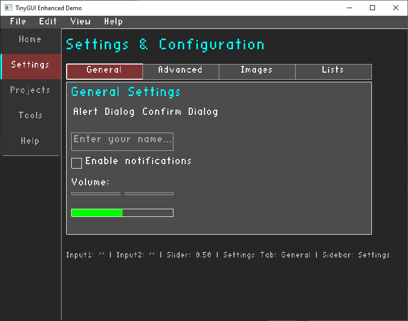

# NovaGUI (TinyGUI)

A powerful, easy-to-use C++ GUI library for building desktop applications with minimal code!



## ✨ Features

### 🎨 **Core Widgets**
- **Windows** with minimum size constraints (800×600)
- **Labels** with custom colors and scaling
- **Buttons** with hover effects and click detection
- **Text Input** with cursor, text selection, copy/paste support
- **Checkboxes** with custom text labels
- **Sliders** with customizable ranges
- **Progress Bars** with custom colors

### 📋 **Menu System**
- **Professional Menu Bar** (File, Edit, View, Help)
- **Dropdown Menus** with separators and disabled items
- **Automatic rendering** - no complex setup required
- **Menu item callbacks** with unique IDs

### 🎨 **Theming & Colors**
- **Built-in color system** (RED, GREEN, BLUE, YELLOW, etc.)
- **Professional themes** (dark theme included)
- **Customizable colors** for all widgets
- **Consistent visual styling**

### 📐 **Layout Management**
- **Auto-layout system** - widgets position themselves
- **Manual positioning** for precise control
- **Spacing controls** and alignment helpers
- **Layout-aware widgets** for rapid development

### 🔧 **Developer Features**
- **Single header file** - just include `tinygui.h`
- **No complex setup** - works out of the box
- **Cross-platform** - Windows, macOS, Linux
- **Beginner-friendly** API with extensive examples

---

## 🏁 Quick Start

### 1. **Include the Library**
```cpp
#include "tinygui.h"
#include <cstdio>
```

### 2. **Basic Application Structure**
```cpp
int main() {
    if (!tinygui::init(800, 600, "TinyGUI Enhanced Demo")) return -1;

    // Char callback for typing (printable characters inserted at caret)
    glfwSetCharCallback(tinygui::ctx.window, [](GLFWwindow*, unsigned int codepoint){
        tinygui::onChar(codepoint);
    });

    // Key callback for navigation, selection, delete/backspace
    glfwSetKeyCallback(tinygui::ctx.window, [](GLFWwindow*, int key, int scancode, int action, int mods){
        tinygui::onKey(key, scancode, action, mods);
    });
    
    // Demo state variables
    static bool checkboxValue = false;
    static float sliderValue = 0.5f;
    static float progressValue = 0.0f;
    
    // Input field states
    static tinygui::InputState input1;
    static tinygui::InputState input2;

    while (!tinygui::windowShouldClose()) {
        tinygui::pollEvents();
        tinygui::beginFrame();
        
        // Easy menu system - handles everything automatically!
        int menuResult = tinygui::easyMenuBar();
        if (menuResult >= 0) {
            printf("Menu item selected: %d\n", menuResult);
            // Handle menu actions:
            // File: 100-104, Edit: 200-205, View: 300-302, Help: 400-401
            if (menuResult == 104) { // Exit
                break; // Exit the main loop
            }
        }
        
        // Adjust content position for menu bar
        float menuOffset = tinygui::getMenuBarHeight() + 10;
        
        // Manual layout demo
        tinygui::label(50, menuOffset, "TinyGUI Enhanced - With Menu Bar", 3.0f, tinygui::COLOR_YELLOW);
        
        if (tinygui::button(50, menuOffset + 25, 120, 40, "Click Me!"))
            printf("Button clicked!\n");
            
        tinygui::input(180, menuOffset + 25, 200, 40, input1, "Enter text here...");
        
        tinygui::checkbox(50, menuOffset + 85, 20, "Enable feature", checkboxValue);
        
        tinygui::slider(50, menuOffset + 125, 200, 20, sliderValue, 0.0f, 1.0f);
        
        // Update progress based on slider
        progressValue = sliderValue;
        tinygui::progressBar(50, menuOffset + 165, 200, 15, progressValue, tinygui::COLOR_GREEN);
        
        // Layout-based demo
        tinygui::beginLayout(400, menuOffset + 25, true, 10);
        
        tinygui::labelLayout("Auto Layout Demo:", 2.5f, tinygui::COLOR_CYAN);
        tinygui::layoutSpacing(5);
        
        if (tinygui::buttonLayout(150, 35, "Layout Button"))
            printf("Layout button clicked!\n");
        
        tinygui::inputLayout(200, 35, input2, "Layout input...");
        
        static bool layoutCheck = true;
        tinygui::checkboxLayout(18, "Layout checkbox", layoutCheck);
        
        static float layoutSlider = 0.3f;
        tinygui::sliderLayout(180, 20, layoutSlider, 0.0f, 2.0f);
        
        // Display all values in GUI
        char valueText[200];
        snprintf(valueText, sizeof(valueText), "Slider: %.2f, Checkbox: %s", 
                sliderValue, checkboxValue ? "ON" : "OFF");
        tinygui::label(50, menuOffset + 215, valueText, 2.0f, tinygui::THEME_TEXT_DIM);
        
        // Display input field contents
        char inputDisplayText[300];
        snprintf(inputDisplayText, sizeof(inputDisplayText), "Input1: '%s'", input1.text);
        tinygui::label(50, menuOffset + 245, inputDisplayText, 2.0f, tinygui::COLOR_CYAN);
        
        snprintf(inputDisplayText, sizeof(inputDisplayText), "Input2: '%s'", input2.text);
        tinygui::label(50, menuOffset + 275, inputDisplayText, 2.0f, tinygui::COLOR_CYAN);

        tinygui::endFrame(); // Automatically handles dropdown menus!
    }

    return 0;
}
```

---

## 📚 Widget Reference

### 🏷️ **Labels**
```cpp
// Basic label
tinygui::label(x, y, "Text");

// Styled label
tinygui::label(x, y, "Colored Text", 2.0f, tinygui::COLOR_RED);
```

### 🔘 **Buttons**
```cpp
if (tinygui::button(x, y, width, height, "Button Text")) {
    // Button was clicked
}
```

### ✏️ **Text Input**
```cpp
// Create input state (one per input field)
static tinygui::InputState myInput;

// Draw input field
tinygui::input(x, y, width, height, myInput, "Hint text...");

// Access the text
printf("User typed: %s\n", myInput.text);
```

### ☑️ **Checkboxes**
```cpp
static bool checked = false;
tinygui::checkbox(x, y, size, "Enable feature", checked);
```

### 🎚️ **Sliders**
```cpp
static float value = 0.5f;
tinygui::slider(x, y, width, height, value, 0.0f, 1.0f);
```

### 📊 **Progress Bars**
```cpp
float progress = 0.75f; // 75%
tinygui::progressBar(x, y, width, height, progress, tinygui::COLOR_GREEN);
```

### 📋 **Menu System**
```cpp
// Easy menu system (handles everything automatically)
int menuResult = tinygui::easyMenuBar();
if (menuResult == 104) { // File -> Exit
    break; // Close application
}
// Menu IDs: File(100-104), Edit(200-205), View(300-302), Help(400-401)
```

---

## 🎨 **Colors & Theming**

### **Predefined Colors**
```cpp
tinygui::COLOR_WHITE
tinygui::COLOR_BLACK
tinygui::COLOR_RED
tinygui::COLOR_GREEN
tinygui::COLOR_BLUE
tinygui::COLOR_YELLOW
tinygui::COLOR_ORANGE
tinygui::COLOR_PURPLE
tinygui::COLOR_CYAN
```

### **Theme Colors**
```cpp
tinygui::THEME_BG          // Background
tinygui::THEME_BUTTON      // Button normal
tinygui::THEME_BUTTON_HOVER // Button hovered
tinygui::THEME_INPUT       // Input field
tinygui::THEME_TEXT        // Normal text
tinygui::THEME_TEXT_DIM    // Disabled text
```

### **Custom Colors**
```cpp
tinygui::Color myColor(1.0f, 0.5f, 0.2f); // RGB values 0.0-1.0
tinygui::label(x, y, "Custom Color", 2.0f, myColor);
```

---

## 📐 **Layout Management**

### **Auto Layout**
```cpp
// Start vertical layout at position (x, y)
tinygui::beginLayout(100, 50, true, 10); // vertical, 10px spacing

// Widgets position themselves automatically
tinygui::labelLayout("Settings");
tinygui::buttonLayout(150, 35, "Save");
tinygui::inputLayout(200, 35, inputState, "Name...");
tinygui::checkboxLayout(20, "Auto-save", autoSave);
tinygui::sliderLayout(180, 20, volume, 0.0f, 1.0f);

// Add extra spacing
tinygui::layoutSpacing(20);
```

### **Manual Positioning**
```cpp
// Position widgets manually
tinygui::button(50, 100, 120, 40, "Button 1");
tinygui::button(200, 100, 120, 40, "Button 2");
```

---

## 🔧 **Build Instructions**

### **Prerequisites**
1. **C++ Compiler** (GCC/MinGW, Visual Studio, or Clang)
2. **GLFW Library** - Install via:
   - **Windows (Conda)**: `conda install -c conda-forge glfw`
   - **Windows (vcpkg)**: `vcpkg install glfw3`
   - **Linux**: `sudo apt-get install libglfw3-dev`
   - **macOS**: `brew install glfw`

### **Build Commands**

#### **Windows (MinGW with Conda)**
```bash
g++ -o myapp.exe main.cpp \
    -I"C:\Users\[User]\miniconda3\Library\include" \
    -L"C:\Users\[User]\miniconda3\Library\lib" \
    -lglfw3dll -lopengl32 -lglu32 -lgdi32
```

#### **Windows (Manual GLFW)**
```bash
g++ -o myapp.exe main.cpp -std=c++17 \
    -I"C:\glfw\include" \
    -L"C:\glfw\lib-mingw-w64" \
    -lglfw3 -lopengl32 -lgdi32 \
    -static-libgcc -static-libstdc++
```

#### **Linux**
```bash
g++ -o myapp main.cpp -lglfw -lGL -lX11 -lpthread -ldl
```

#### **macOS**
```bash
g++ -o myapp main.cpp -lglfw -framework OpenGL -framework Cocoa -framework IOKit
```

---

## 📁 **File Structure**
```
YourProject/
├── tinygui.h          # Main library (single header)
├── stb_easy_font.h    # Font rendering (included)
├── main.cpp           # Your application
└── README.md
```

---

## 🎯 **Complete Example**

```cpp
#include "tinygui.h"
#include <cstdio>

int main() {
    if (!tinygui::init(800, 600, "My GUI App")) return -1;

    // Input callbacks
    glfwSetCharCallback(tinygui::ctx.window, [](GLFWwindow*, unsigned int c){
        tinygui::onChar(c);
    });
    glfwSetKeyCallback(tinygui::ctx.window, [](GLFWwindow*, int key, int scancode, int action, int mods){
        tinygui::onKey(key, scancode, action, mods);
    });

    // Application state
    static tinygui::InputState nameInput;
    static tinygui::InputState emailInput;
    static bool notifications = true;
    static float volume = 0.7f;

    while (!tinygui::windowShouldClose()) {
        tinygui::pollEvents();
        tinygui::beginFrame();

        // Handle menu
        int menu = tinygui::easyMenuBar();
        if (menu == 104) break; // Exit

        float menuHeight = tinygui::getMenuBarHeight();

        // Manual layout
        tinygui::label(50, menuHeight + 20, "User Settings", 3.0f, tinygui::COLOR_YELLOW);
        
        tinygui::label(50, menuHeight + 60, "Name:");
        tinygui::input(120, menuHeight + 55, 200, 30, nameInput, "Enter your name...");
        
        tinygui::label(50, menuHeight + 100, "Email:");
        tinygui::input(120, menuHeight + 95, 200, 30, emailInput, "Enter email...");
        
        tinygui::checkbox(50, menuHeight + 140, 20, "Enable notifications", notifications);
        
        tinygui::label(50, menuHeight + 180, "Volume:");
        tinygui::slider(120, menuHeight + 180, 200, 20, volume, 0.0f, 1.0f);
        
        tinygui::progressBar(50, menuHeight + 220, 200, 15, volume, tinygui::COLOR_GREEN);
        
        if (tinygui::button(50, menuHeight + 260, 100, 35, "Save Settings")) {
            printf("Name: %s\n", nameInput.text);
            printf("Email: %s\n", emailInput.text);
            printf("Notifications: %s\n", notifications ? "ON" : "OFF");
            printf("Volume: %.2f\n", volume);
        }

        // Auto layout example
        tinygui::beginLayout(400, menuHeight + 60, true, 10);
        tinygui::labelLayout("Quick Actions:", 2.0f, tinygui::COLOR_CYAN);
        if (tinygui::buttonLayout(150, 30, "Quick Save")) {
            printf("Quick save clicked!\n");
        }
        if (tinygui::buttonLayout(150, 30, "Load Defaults")) {
            volume = 0.5f;
            notifications = true;
        }

        tinygui::endFrame();
    }

    return 0;
}
```

---

## 🌟 Future Plans

- **Multi-line Text Areas** with word wrap and scrolling
- **Tree View Widgets** for hierarchical data
- **Table/Grid Components** with sortable columns
- **Color Picker Widget** with HSV/RGB support
- **File Dialog System** with filtering and preview
- **Drag & Drop Support** for enhanced interactivity
- **Animation Framework** for smooth transitions
- **Custom Font Support** with TTF loading
- **Theme System** with multiple built-in themes

---

## 📖 Example

See `main.cpp` for a comprehensive demo featuring:
- Modern sidebar navigation
- Horizontal tabs within content areas
- All widget types with proper interaction
- Image loading and display
- Modal dialogs and menus
- Automatic layout management

---

**NovaGUI** makes it easy to create professional, modern desktop applications with C++. The library handles the complex OpenGL rendering while providing a simple, intuitive API for building user interfaces.

Perfect for:
- **Desktop Applications** - Settings panels, configuration tools
- **Development Tools** - IDEs, editors, debugging interfaces  
- **Games** - In-game menus, HUDs, configuration screens
- **Prototyping** - Quick UI mockups and interactive demos

**Get started today and build beautiful GUIs with just a few lines of code!** 🚀
